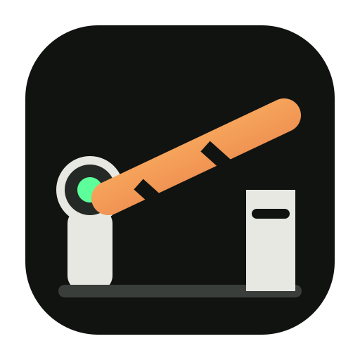

<p align="center"></p>
<p align="center"></p>

<p align="center"><strong>Eine Sicherheitsschranke für KI-Agenten.</strong></p>

TollGate prüft eine Handlung, bevor ein Agent sie ausführt. Es kann Schleifen stoppen, Budgets begrenzen und Ausfälle sichtbar machen.

### 👤 [Für Nutzer – TollGate ausprobieren](#für-nutzer)

### 🛠️ [Für Entwickler – Code und technische Dokumentation](#für-entwickler)

---

## Für Nutzer

### Einfach erklärt

Ein KI-Agent kann Werkzeuge benutzen, Internetdienste aufrufen und dabei Kosten verursachen. Wenn etwas schiefläuft, kann er denselben Aufruf immer wieder ausführen.

TollGate sitzt davor. Es beantwortet eine Frage:

> **Darf ich handeln?**

### Was du davon hast

- Endlosschleifen werden gestoppt.
- Kosten können begrenzt werden.
- Zugriffe erhalten klare Regeln.
- Bei einem ausgefallenen Anbieter kann kontrolliert gewechselt werden.
- Entscheidungen werden für eine spätere Prüfung festgehalten.

### In drei Schritten

1. **Installieren** – TollGate lokal einrichten.
2. **Testen** – eine ungefährliche Agentenschleife ausführen.
3. **Prüfen** – sehen, warum TollGate den Aufruf erlaubt oder blockiert hat.

### Was TollGate nicht ist

TollGate ist kein KI-Modell, kein Agent und kein Passwort-Tresor. Es ersetzt auch nicht die Entscheidung des Menschen. Es ist eine eigene Kontrollschicht vor einer Handlung.

### Heutiger Stand – ehrlich

| Bereich | Aktueller Stand |
|---|---|
| Protect | Budgets, Schleifenstopps, Scopes und Freeze |
| Route | Zustandsabhängige Weiterleitung und Failover |
| Prove | Chaos- und Wiederanlauf-Tests mit Nachweisen |
| Schnittstellen | OpenAI-kompatibel, MCP und n8n |
| Technik | Python und FastAPI |
| Reife | In Entwicklung; vor Produktion selbst prüfen |

[Produktseite](https://tollgate.netzwerkpunkt.de/) · [Schnellstart](docs/QUICKSTART.md)

---

## Für Entwickler

TollGate ist ein vorgeschaltetes Admission Gate für Tool- und Modellaufrufe. Es entscheidet vor dem Request und hält den Grund der Entscheidung fest.

## How this is built / Wie dieses Projekt entsteht

**System Designer & Product Architect** — Daniel Filipek (landjunge)

Ich arbeite anders: Ich entwickle Systeme und Produkte mit KI als technischem Partner.

Meine Stärke liegt darin, Probleme zu erkennen, Systeme in eigenständige Werkzeuge zu zerlegen und klare Grenzen und Schnittstellen zu definieren. Produktvision, Prioritäten und Architekturentscheidungen kommen von mir. KI ist der technische Partner für Implementierung, Tests und Dokumentation.

Ich bin kein klassischer Softwareentwickler und kein Security-Spezialist. Die technische Umsetzung entsteht gemeinsam mit KI und muss – besonders bei sicherheitskritischen Projekten – überprüfbar sein.

Was ich einbringe: Idee, Systemdenken, Anforderungen, gewünschtes Verhalten, klare Grenzen.  
Was überprüfbar sein muss: der Code, die Specs, die Tests. Reviews sind willkommen.

Open Source und öffentlich entwickelt. Kritik, Tests und Beiträge sind willkommen.

TollGate beantwortet **„Darf ich handeln?“** — ein eigenes Produkt, kein Plugin der anderen.

```text
AI Agent
   │
   ├── tool call #1
   ├── tool call #2
   ├── tool call #3
   ├── tool call #4
   └── tool call #5

TollGate

🛑 TOOL LOOP LIMIT EXCEEDED

Agent blocked.
Budget remaining: $1.72
Evidence recorded.
```

---

## 10 minutes (cold start)

**Primary path: native Python — no Docker.** Protect demo needs no provider keys.

```bash
git clone https://github.com/landjunge/tollgate.git && cd tollgate
python3 -m venv .venv && .venv/bin/pip install -e .
./scripts/ten-minute.sh
# 60-second Protect story (optional, server on :8787):
./scripts/demo-agent-safety.sh
```

**USB stick / portable desk** (venv + data on the volume):

```bash
./scripts/portable-setup.sh
./scripts/run.sh
# details: docs/PORTABLE.md
```

You should experience:

| Step | What happens |
|------|----------------|
| **Protect** | Agent tool-loop → `🛑 REQUEST BLOCKED` (no $ required) |
| **Prove** | Chaos / failover simulation → survived or clear next step |
| **Result** | `tollgate certificate` scorecard + [dashboard](http://127.0.0.1:8787/dashboard) |

**Start here (3 docs):**  
[Quickstart](docs/QUICKSTART.md) · [Portable / USB](docs/PORTABLE.md) · [How it works](docs/HOW_IT_WORKS.md) · [Production checklist](docs/PRODUCTION_CHECKLIST.md)

**More:** [SECURITY.md](docs/SECURITY.md) · [OPENAI.md](docs/OPENAI.md) · [HILFE.md](docs/HILFE.md) (DE) · [FAQ.md](docs/FAQ.md) · `tollgate help` · `tollgate doctor`

If that path is confusing, **stop shipping features** — fix the path.

---

## Who it’s for

| | |
|--|--|
| Teams running agents in production | cost · loops · outages · audit · freeze |
| Agent frameworks (LangGraph, CrewAI, …) | sit in front of tools + LLMs |
| n8n / automation | stop workflow agent-loops at the gate |

**Wedge:** LiteLLM connects models. Helicone shows traffic. **TollGate keeps agents in line.**

---

## Product (short)

| Pillar | Job |
|--------|-----|
| **Protect** | Budgets, tool-loop hard stops, scopes, freeze, audit |
| **Route** | Health-aware failover, circuits |
| **Prove** | Chaos/DR tests, resilience score, certificate scorecard |

Deep dive: [docs/PRODUCT.md](docs/PRODUCT.md) · Architecture: [docs/ARCHITECTURE.md](docs/ARCHITECTURE.md)

---

## Everyday commands (after the 10 minutes)

```bash
tollgate status
tollgate certificate --application "Customer Support Agent"
tollgate consumer-budget support-agent --max-usd-day 2 --max-tool-calls 20
tollgate chaos test opencode_zen --requests 10
tollgate freeze --reason "panic"    # kill switch
tollgate report                     # day brief
```

Point an agent / OpenAI SDK:

```bash
export OPENAI_BASE_URL=http://127.0.0.1:8787/v1
export OPENAI_API_KEY=support-agent   # open mode label, or id:secret
```

---

## vs gateways (optional reading)

| | **TollGate** | LiteLLM | Helicone |
|--|--------------|---------|----------|
| Core job | **Agent safety + DR proof** | Multi-provider proxy | Observability |
| Pre-admission hard deny | ✅ | optional | mostly post-hoc |
| Chaos / prove | ✅ first-class | DIY | — |

---

## Docs index

| Doc | When |
|-----|------|
| [HILFE.md](docs/HILFE.md) | **Hilfe (Deutsch)** |
| [USER_GUIDE.md](docs/USER_GUIDE.md) | **User guide (English)** |
| [FAQ.md](docs/FAQ.md) | **FAQ** |
| [TEN_MINUTE.md](docs/TEN_MINUTE.md) | First 10 minutes |
| [DEMO.md](docs/DEMO.md) | Pitch / screen share |
| [GETTING_STARTED.md](docs/GETTING_STARTED.md) | Setup details |
| [MAP.md](docs/MAP.md) · `tollgate search` | Find code |
| [N8N.md](docs/N8N.md) · [OPENAI.md](docs/OPENAI.md) | Integrations |
| [CHANGELOG.md](CHANGELOG.md) | Releases · **v1.0.0+** |

**License:** MIT · **Python:** ≥ 3.11 · **Repo:** [landjunge/tollgate](https://github.com/landjunge/tollgate)
